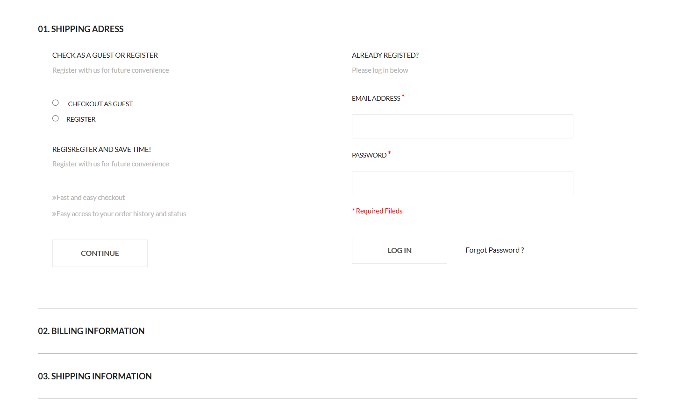
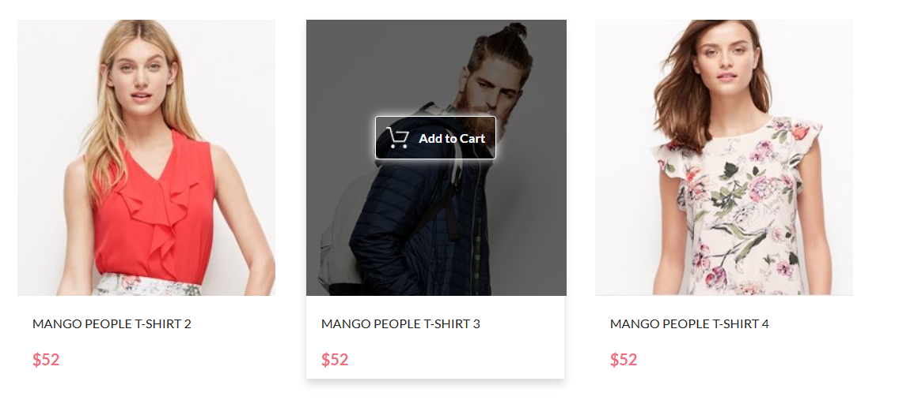
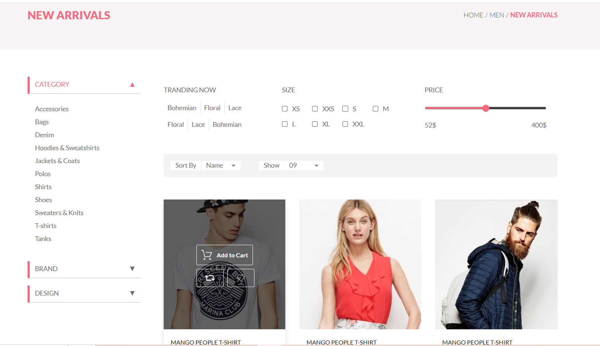
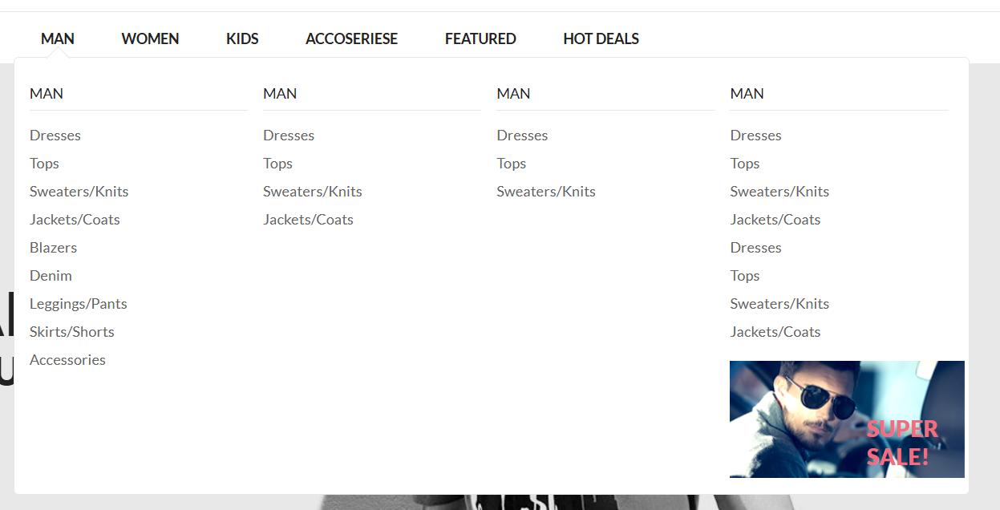
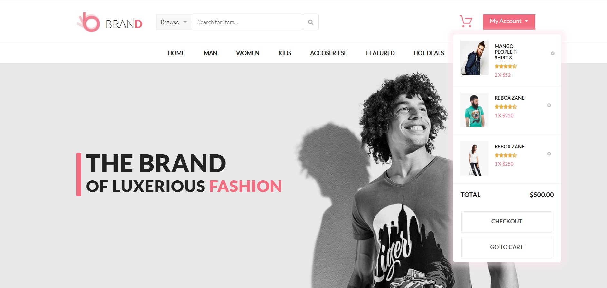
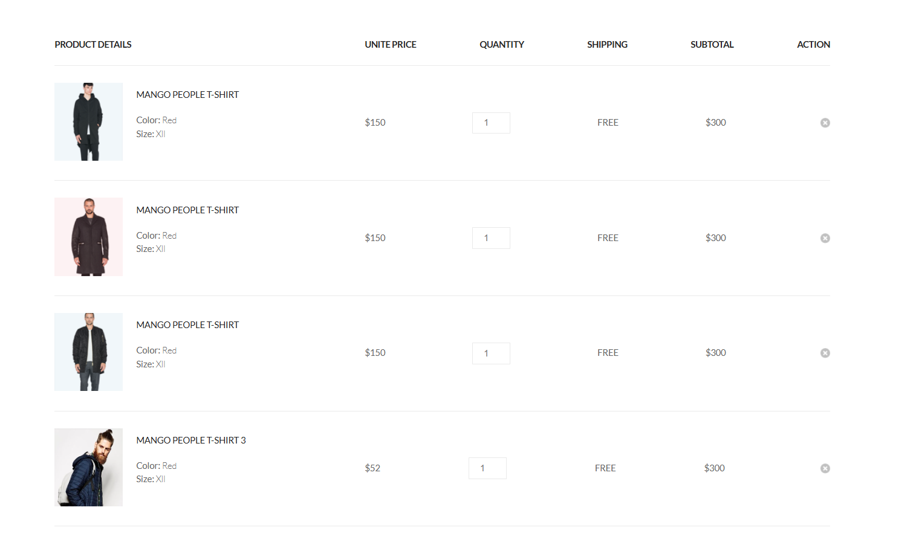
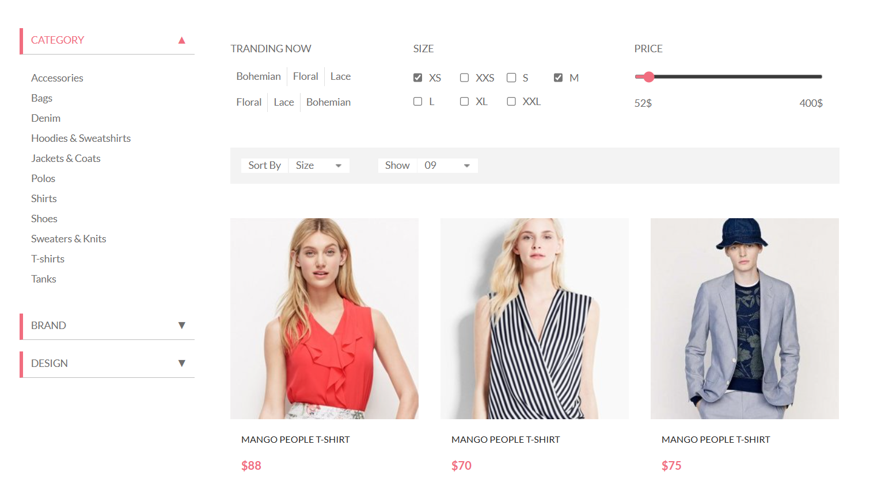

# BRAND 

Интернет-магазин одежды и аксессуаров  / Online clothing and accessories store

## Описание проекта / Description of the project

BRAND - это многостраничный сайт, интернет-магазин одежды и аксессуаров для взрослых и детей! 
BRAND is a multi-page website, an online clothing and accessories store for adults and children!

В рамках проекта я реализовала функционал корзины, который значительно улучшает пользовательский опыт. Вот основные задачи, которые я выполнила / As part of the project, I implemented the functionality of the shopping cart, which significantly improves the user experience. Here are the main tasks that I have completed:
1. **Верстка**: Продемонстрировала свои навыки в верстке, используя редактор Figma, а также HTML и CSS. Я аккуратно перенесла весь контент из макета, обеспечивая точное соответствие оригинальному дизайну. 
**Layout**: Demonstrated her layout skills using the Figma editor, as well as HTML and CSS. I carefully moved all the content from the layout, ensuring an exact match to the original design.

2. **Интерактивность**: Внедрила эффекты наведения, придающие элементам динамичность.
**Interactivity**: Implemented hover effects that make the elements dynamic.

3. **Выпадающее меню**: Реализовала выпадающее меню, которое обеспечивает удобную навигацию по сайту и улучшает пользовательский опыт
**Drop-down menu**: Implemented a drop-down menu that provides easy site navigation and enhances the user experience.
 

4. **Добавление и удаление товара в корзине**: Оформила добавление при клике на кнопку `Add to Cart` и удаление товаров из корзины. Настроила обработку кликов, чтобы добавлять товары в корзину и обновлять их количество, если они уже присутствуют. 
**Adding and removing items in the cart**: Completed the addition by clicking on the 'Add to Cart` button and removing items from the cart. I have configured click processing to add items to the cart and update their quantity if they are already present.

5. **Добавление и удаление товара на странице `shopping cart`**: Товар ранее добавленный в корзину отображается на странице `shopping_cart.html`с содержимым. Это позволяет пользователю видеть всю корзину и легко оформить заказ товаров.Я реализовала возможность удаления товара со страницы корзины. При нажатии на крестик товар удаляется со страницы. Это делает интерфейс более функциональным.
**Adding and removing an item on the `shopping cart` page**: An item previously added to the shopping cart is displayed on the page `shopping_cart.html `with the contents. This allows the user to see the entire shopping cart and easily place an order for items.I have implemented the option to delete an item from the shopping cart page. When you click on the cross, the product is removed from the page. This makes the interface more functional.

6. **React**: Перенесла этот сайт на React, что позволило не только улучшить производительность, но и повысить удобство работы с кодом. На странице `product` добавила возможность сортировки товаров по выбранному размеру. Применение компонентного подхода в React упростило процесс разработки и сделало проект более масштабируемым, что открывает новые возможности для его дальнейшего расширения.
**React**: Migrated this site to React, which allowed not only to improve performance, but also to improve the convenience of working with the code. On the `product` page, I added the ability to sort products by the selected size. The use of the component approach in React has simplified the development process and made the project more scalable, which opens up new opportunities for its further expansion.

## Технологии / Technologies

* Figma: Использовала Figma для создания сайта согласно представленному макету.
* JavaScript API: Я использовала fetch для асинхронной работы с данными и localStorage для сохранения состояния корзины.  
* Обработка событий: С помощью addEventListener я настроила обработку кликов, чтобы добавлять товары в корзину и обновлять их количество, если они уже присутствуют.  
* Работа с DOM: Я использовала document.addEventListener("DOMContentLoaded") для инициализации приложения и insertAdjacentHTML() для динамического добавления новых товаров в корзину.  
* Динамическое обновление: Я обеспечила динамическое обновление DOM, используя querySelector для манипуляции содержимым текста, что позволяет обновлять цену и количество товаров в реальном времени.  
* Удаление элементов из корзины: Для удаления товаров я использовала метод closest(), чтобы находить родительский элемент, который нужно удалить.  
* React: Применила фреймворк для улучшения взаимодействия с кодом и улучшения производительности сайта. 
**UI/UX улучшения:** Я сосредоточилась на создании удобного интерфейса, где добавление товаров происходит через кнопку, а корзина автоматически обновляется при добавлении новых товаров. Пользователь также может легко удалить товар из корзины. Сохранение данных в localStorage позволяет восстанавливать корзину при перезагрузке страницы, что значительно улучшает взаимодействие с приложением.  

* Figma: Used Figma to create a website according to the presented layout.
* JavaScript API: I used fetch to work asynchronously with data and localStorage to save the bucket state.  
* Event handling: Using addEventListener, I have configured click handling to add items to the cart and update their quantity if they are already present.  
* Working with DOM: I used document.addEventListener("DOMContentLoaded") to initialize the application and insertAdjacentHTML() to dynamically add new items to the cart.  
* Dynamic update: I have provided dynamic DOM updates using querySelector to manipulate the text content, which allows you to update the price and quantity of goods in real time.  
* Deleting items from the shopping cart: To delete items, I used the closest() method to find the parent item that needs to be deleted.  
* React: Applied the framework to improve interaction with the code and improve site performance. 
**UI/UX improvements:** I focused on creating a user-friendly interface where adding products takes place via a button, and the shopping cart is automatically updated when new products are added. The user can also easily delete an item from the shopping cart. Saving data to localStorage allows you to restore the trash when the page is reloaded, which significantly improves interaction with the application.

## Установка зависимостей и запуск проекта / Installing dependencies and launching the project

Склонируйте репозиторий / Clone the repository:
* git clone https://github.com/Maxi-hub/React.git
* cd React/brand
* npm install
* npm start