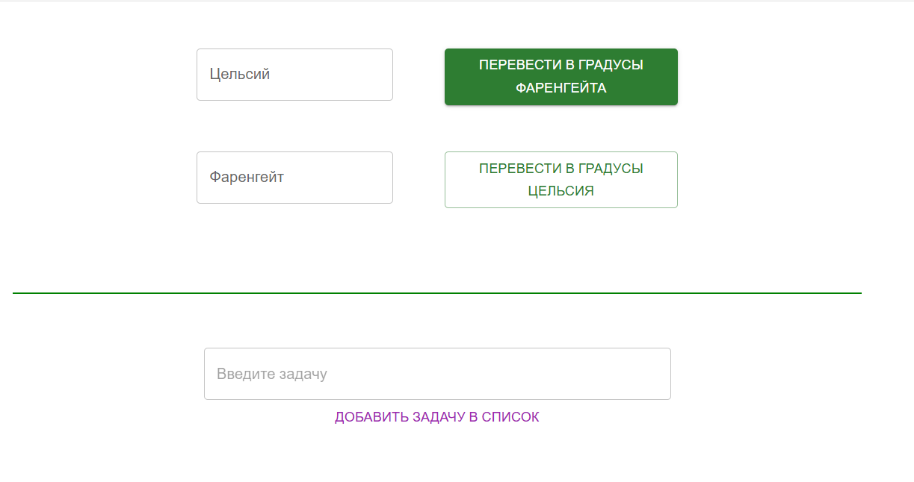
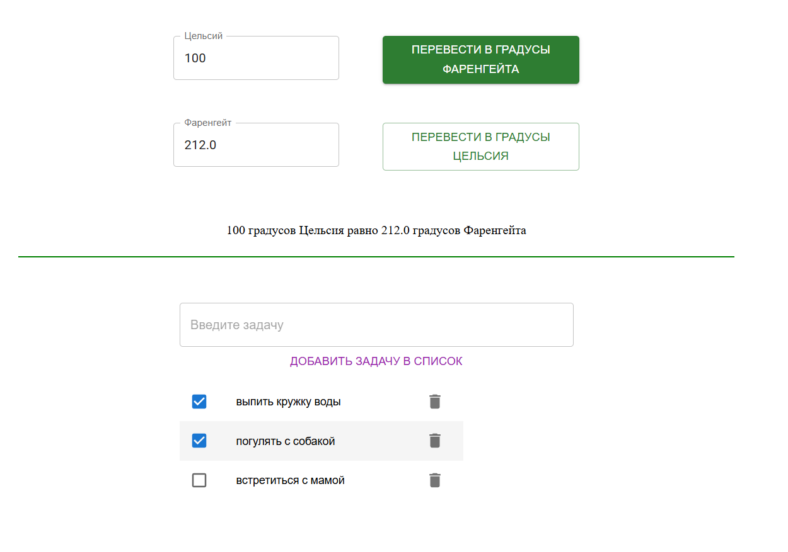

# Название проекта / Project Title

Конвертер температур и список задач / temperature converter and tasks list.

## Краткое описание проекта / Brief description of the project

Конвертер температур и добавление списка задач реализованы с использованием библиотеки React Material UI.
Основной упор сделан на использование компонентов библиотеки Material UI, в связи с чем визуальная часть выполнена просто.

The temperature converter and the addition of a task list are implemented using the React Material UI library.
The main focus is on the use of the components of the Material UI library, the visual part is designed simply.

## Описание / Description

Введите числовое значение температуры в соответствующее поле, чтобы перевести его в градусы Цельсия или Фаренгейта. Полученное значение отображается ниже.
Введите название задачи в соответствующее поле, и она будет добавлена в список дел. Нажмите на изображение бокса, чтобы отметить ее как выполненную, или удалите ее, нажав на изображение корзины.

Enter a numeric temperature value in the appropriate field to convert it to Celsius or Fahrenheit. The received value is displayed below.
Enter the name of the task in the appropriate field and it will be added to the to-do list. Click on the image of the box to mark it as completed or delete it by clicking on the image of the basket.

## Используемые библиотеки / Libraries used:

React
Material-UI

## Установка зависимостей / Project setup, Installation^

Склонируйте репозиторий / Clone the repository:
git clone https://github.com/Maxi-hub/React.git
cd React/material-ui
npm install
npm start
