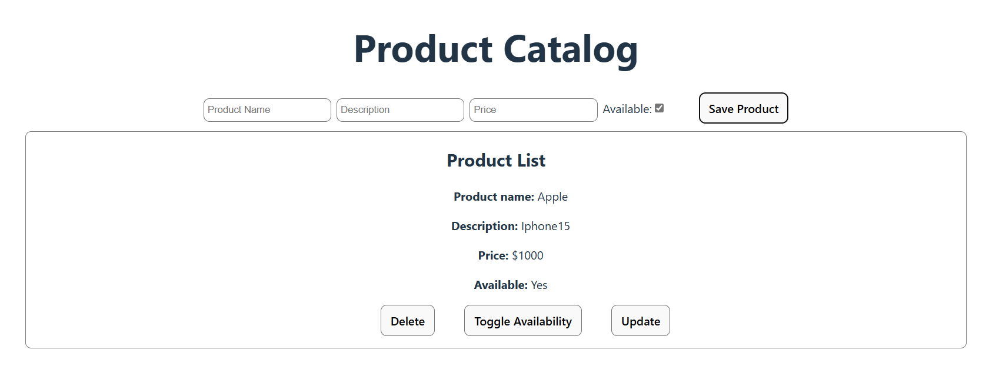

# Каталог товаров — React + Redux + Vite / Product Catalog — React + Redux + Vite

## Описание проекта / Description of the project

В этом проекте я создала каталог продуктов, где можно добавлять, обновлять, удалять и менять доступность товаров. Я использовала React, Redux для управления состоянием и Vite для быстрого старта и сборки проекта. В этом проекте реализована возможность работы с контекстом (Context API) для выделения выбранного товара и функционал динамического изменения состояния товаров в реальном времени.

Задачи, которые я выполнила:
- Настройка Redux для управления продуктами: я настроила хранилище Redux, используя configureStore и создала редьюсер с экшенами для добавления, удаления, обновления и изменения доступности продуктов.
- Создание компонента AddProduct: в компоненте AddProduct реализовала форму для добавления нового продукта или обновления существующего. Это позволяет легко управлять списком продуктов, создавая новый или редактируя уже добавленный.
- Реализация функционала для отображения списка продуктов: в компоненте ProductList я отобразила список продуктов с возможностью удалить, обновить информацию или изменить доступность товара.
- Использование Context API: я создала FoundProductContext, который позволяет хранить и передавать информацию о выбранном продукте. Это облегчает обновление данных о продукте через форму.
- Интеграция с Vite: используя Vite, я настроила проект для быстрой разработки и минимизации времени на сборку. Vite предоставляет значительное улучшение производительности по сравнению с Create React App.

## Технологии / Technologies

* React: Для создания интерфейса и управления состоянием компонентов.
* Redux: Для управления состоянием приложения и хранения данных о продуктах.
* Vite: Для быстрой сборки проекта и разработки.
* Context API: Для передачи информации о выделенном продукте между компонентами.
* PropTypes: Для проверки типов пропсов и повышения надежности кода.

## Установка зависимостей и запуск проекта / Installing dependencies and launching the project

Склонируйте репозиторий / Clone the repository:
* git clone https://github.com/Maxi-hub/React.git
* cd React/product-catalog
* npm install
* npm run dev